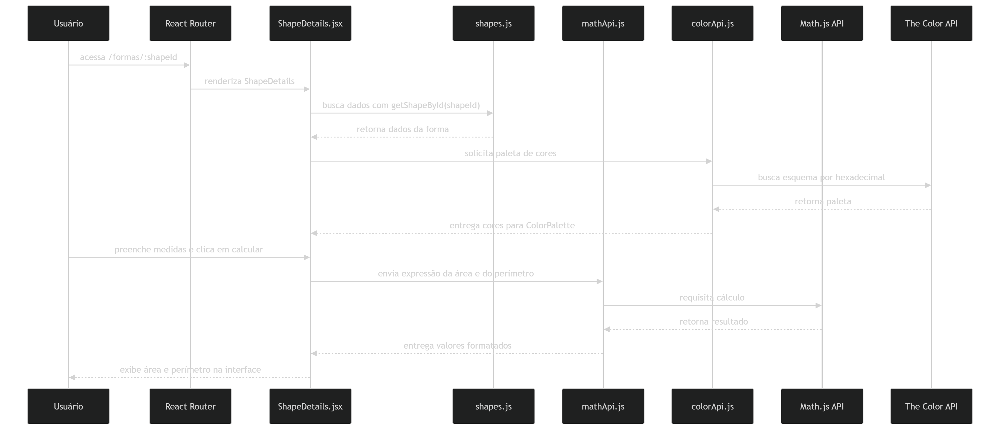
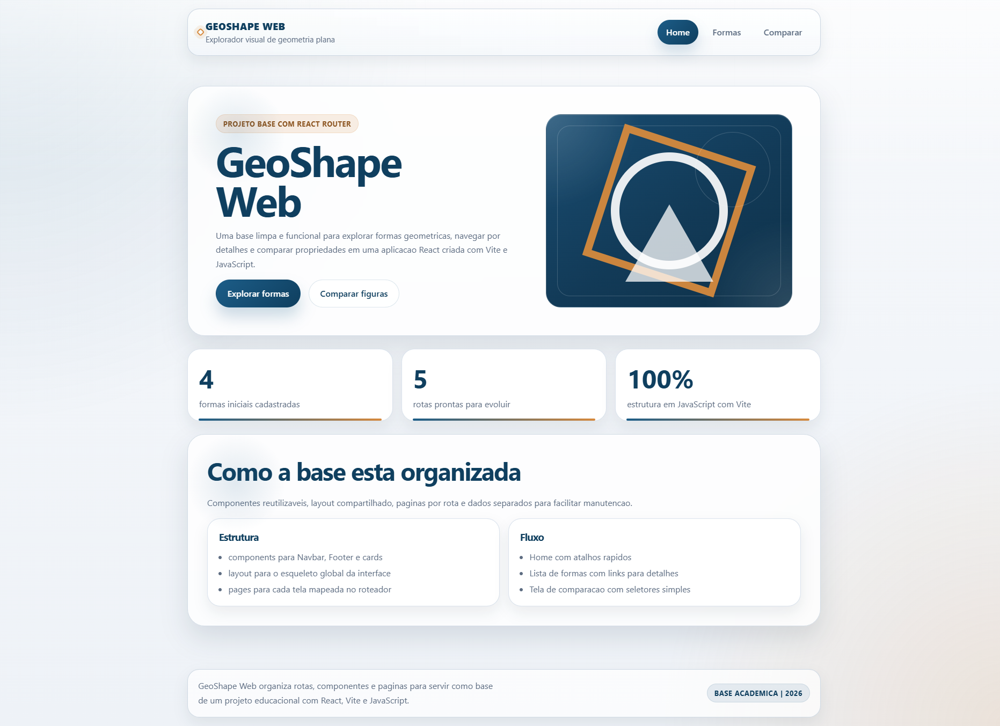
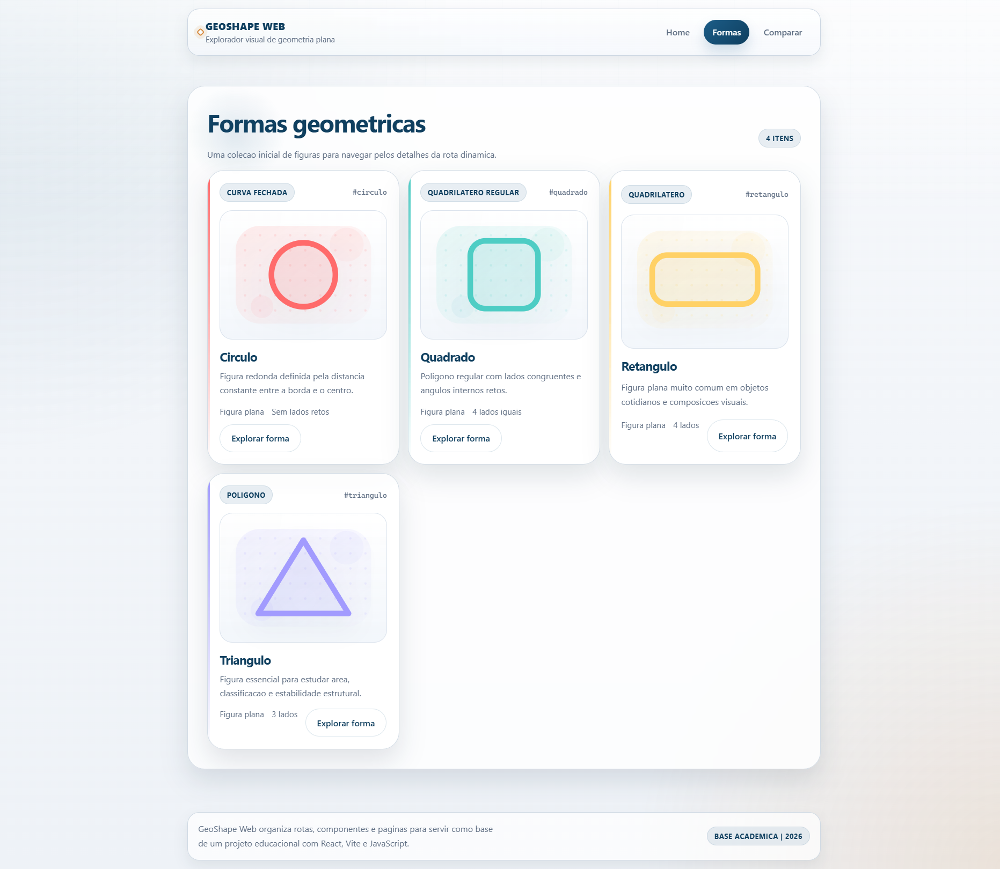
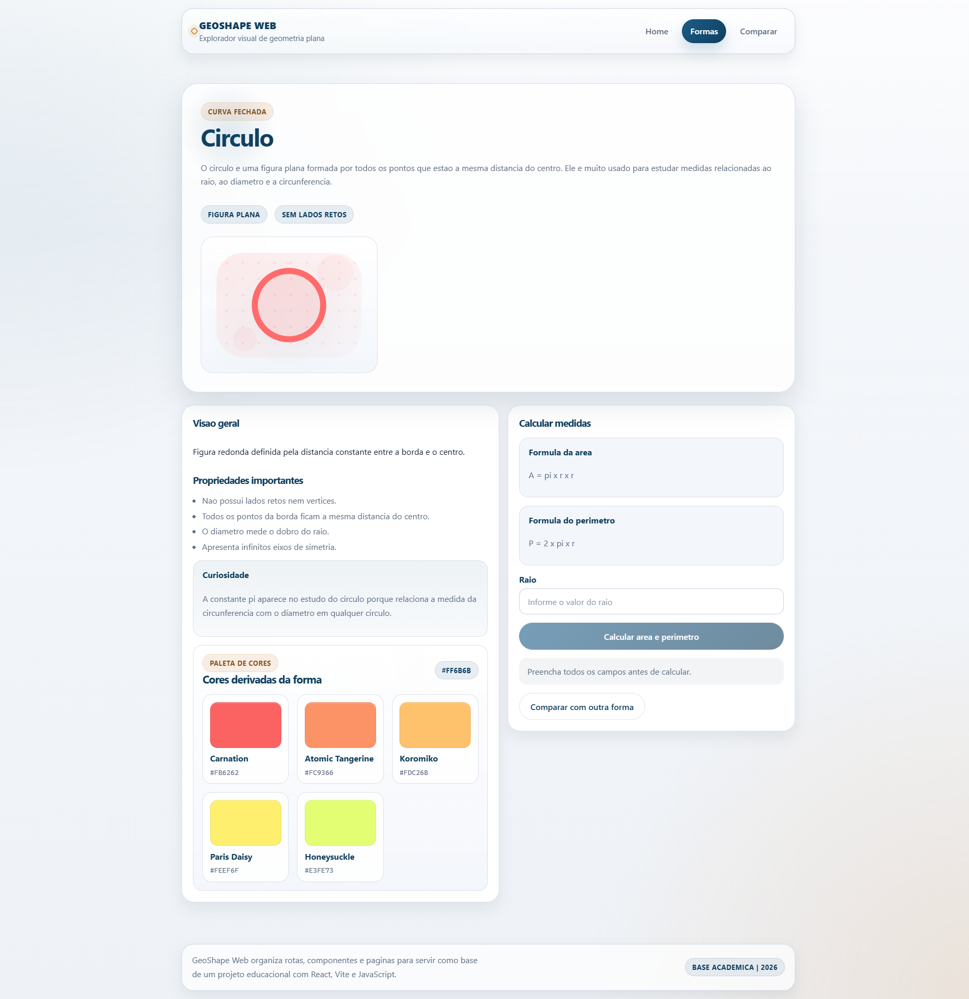
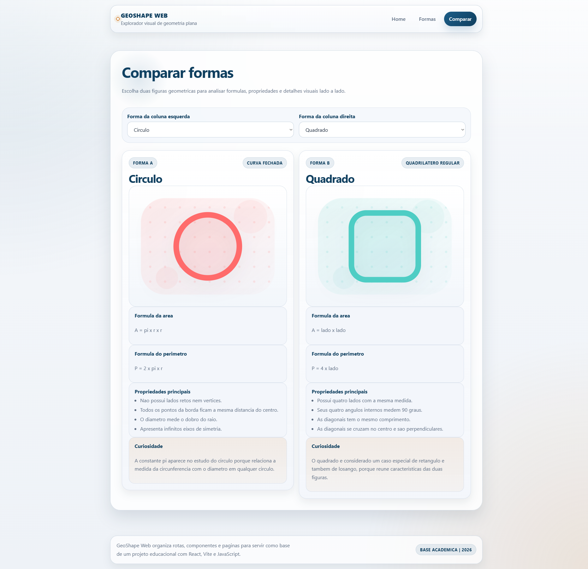

# GeoShape Web

Aplicacao web desenvolvida em React para estudo de formas geometricas planas, com foco em visualizacao, comparacao e calculo de medidas. O projeto apresenta uma interface moderna e academica para explorar circulo, quadrado, retangulo e triangulo de forma intuitiva.

## Descricao do Projeto

O GeoShape Web foi criado como uma aplicacao educacional para organizar conceitos de geometria plana em uma experiencia visual e interativa. A proposta e reunir informacoes teoricas, formulas matematicas, propriedades relevantes e curiosidades em um unico ambiente, facilitando o aprendizado e a apresentacao do conteudo.

## Funcionalidades

- listagem de formas geometricas com cards visuais
- preview SVG gerado sem imagens externas
- pagina individual para cada forma com rota dinamica
- exibicao de descricao, formulas, propriedades e curiosidades
- calculo de area e perimetro com validacao de campos
- integracao com a Math.js API para processar expressoes matematicas
- comparacao lado a lado entre duas formas
- paleta de cores derivada da cor principal de cada forma
- integracao com a The Color API para buscar esquemas de cores
- layout responsivo basico com foco em desktop

## Tecnologias Usadas

- React 19
- Vite
- React Router
- JavaScript
- CSS puro
- ESLint

## APIs Utilizadas

### Math.js API

Usada para avaliar expressoes matematicas geradas a partir dos dados inseridos pelo usuario na pagina de detalhes de cada forma.

- endpoint base: `https://api.mathjs.org`
- uso no projeto: calculo de area e perimetro

### The Color API

Usada para gerar esquemas de cores a partir do hexadecimal principal associado a cada forma geometrica.

- endpoint base: `https://www.thecolorapi.com/scheme`
- uso no projeto: exibicao de paletas complementares e harmonicas

## Instrucoes de Instalacao

### Pre-requisitos

- Node.js 18 ou superior
- npm

### Passos

1. Clone o repositorio:

```bash
git clone <URL_DO_REPOSITORIO>
```

2. Acesse a pasta do projeto:

```bash
cd geometria-web
```

3. Instale as dependencias:

```bash
npm install
```

## Comandos Para Rodar Localmente

### Ambiente de desenvolvimento

```bash
npm run dev
```

Inicia o servidor local do Vite.

### Build de producao

```bash
npm run build
```

Gera a versao otimizada da aplicacao.

### Preview da build

```bash
npm run preview
```

Executa localmente a versao de producao gerada.

### Lint

```bash
npm run lint
```

Analisa o codigo com ESLint.

## Estrutura de Pastas

```text
geometria-web/
|-- docs/
|   `-- prints/
|       |-- comparacao.png
|       |-- detalhes-da-forma.png
|       |-- home.png
|       |-- lista-de-formas.png
|       `-- mermaid-diagram.png
|-- public/
|-- src/
|   |-- api/
|   |   |-- colorApi.js
|   |   `-- mathApi.js
|   |-- assets/
|   |   |-- hero.png
|   |   |-- react.svg
|   |   `-- vite.svg
|   |-- components/
|   |   |-- ColorPalette.jsx
|   |   |-- Footer.jsx
|   |   |-- Navbar.jsx
|   |   |-- ShapeCard.jsx
|   |   `-- ShapePreview.jsx
|   |-- data/
|   |   `-- shapes.js
|   |-- layout/
|   |   `-- MainLayout.jsx
|   |-- pages/
|   |   |-- Compare.jsx
|   |   |-- Home.jsx
|   |   |-- NotFound.jsx
|   |   |-- ShapeDetails.jsx
|   |   `-- Shapes.jsx
|   |-- App.jsx
|   |-- index.css
|   |-- main.jsx
|   `-- router.jsx
|-- index.html
|-- package.json
|-- README.md
|-- vercel.json
`-- vite.config.js
```

## Diagrama de Arquitetura



## Secao de Prints

### Home



### Lista de Formas



### Detalhes da Forma



### Comparacao



## Aplicacao Online

Link para acesso publico da aplicacao:

https://geo-shape-web.vercel.app

## Observacao

Este projeto possui foco educacional e foi estruturado para demonstrar conceitos de React, roteamento, componentizacao, integracao com APIs e organizacao visual de conteudo academico.
